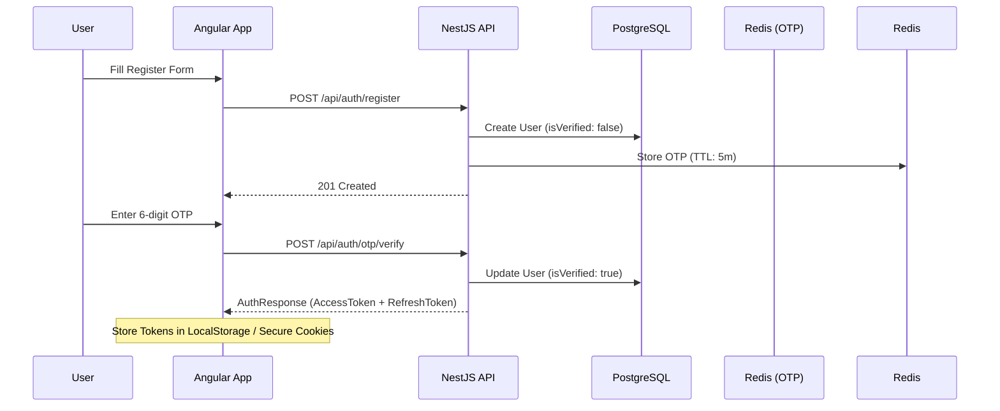

# UniGuide Master Auth Plan (Angular + NestJS)

## 1. Architecture Overview
Project UniGuide follows a modern full-stack architecture using **NestJS** (v11) for the backend and **Angular** (v18+) for the frontend.

### ── Full Authentication Flow ──


---

## 2. Backend Requirements (NestJS Implementation)

### ── Current Structure ──
We are using the following structure in `backend/src/modules/auth`:
*   `AuthController`: Handles routing (`/api/auth/login`, etc.)
*   `AuthService`: Logic for JWT issuance and validation.
*   `Strategies`: `JwtStrategy` for protecting routes.

### ── Security Layers ──
1.  **Password Hashing**: Using `bcrypt` inside `AuthService`.
2.  **JWT Rotation**: 
    *   `AccessToken`: Valid for 15m (Short-lived).
    *   `RefreshToken`: Valid for 7d (Stored in DB/Cookie).
3.  **Validation**: All DTOs are protected by `class-validator`.

---

## 3. Frontend Requirements (Angular Implementation)

### ── State Management (Signals) ──
Since we are using **Angular 18**, we will use **Signals** in `AuthService` for reactive state:

```typescript
// src/app/core/auth/auth.service.ts
private user = signal<User | null>(null);
isAuthenticated = computed(() => !!this.user());
```

### ── API Service Layer ──
*   **ApiService**: A generic wrapper around `HttpClient` to handle base URL and common headers.
*   **Interceptors**: 
    *   `JwtInterceptor`: Adds the Bearer token to every request.
    *   `ErrorInterceptor`: Catches 401/403 errors and triggers the **RefreshToken** flow.

---

## 4. PostgreSQL Table Design (Updated)

| Table | Column | Type | Description |
| :--- | :--- | :--- | :--- |
| **users** | `id` | UUID | Primary Key |
| | `email` | String | Unique Email |
| | `password` | String | Hashed Password |
| | `role` | Enum | student, parent, admin |
| | `isVerified` | Boolean | For OTP verification |
| | `refreshToken` | String | Encrypted Refresh Token |

---

## 5. User Experience (UX) Flow
1.  **Post-Login**:
    *   Update Navbar using the `currentUser` signal.
    *   Show user avatar or initials.
    *   Enable the **Logout** button.
2.  **Session Persistence**:
    *   On app initialization, `AuthService` checks `localStorage`.
    *   If a token exists, it calls `/api/auth/me` to restore the user session.
3.  **Security**:
    *   Automatic logout if the Refresh Token is expired or invalid.

---

## 6. Integration Steps (Action Plan)

1.  **Step 1**: Complete the `AuthService.login()` logic in the backend to return the full payload.
2.  **Step 2**: Implement the `JwtInterceptor` in Angular to secure all future API calls.
3.  **Step 3**: Create the **OTP Verification Component** in Angular to handle the post-registration step.
4.  **Step 4**: Setup the **AuthGuard** to prevent unauthenticated users from accessing the `/dashboard`.
5.  **Step 5**: Test the full cycle from Register -> OTP -> Login -> Logout.
